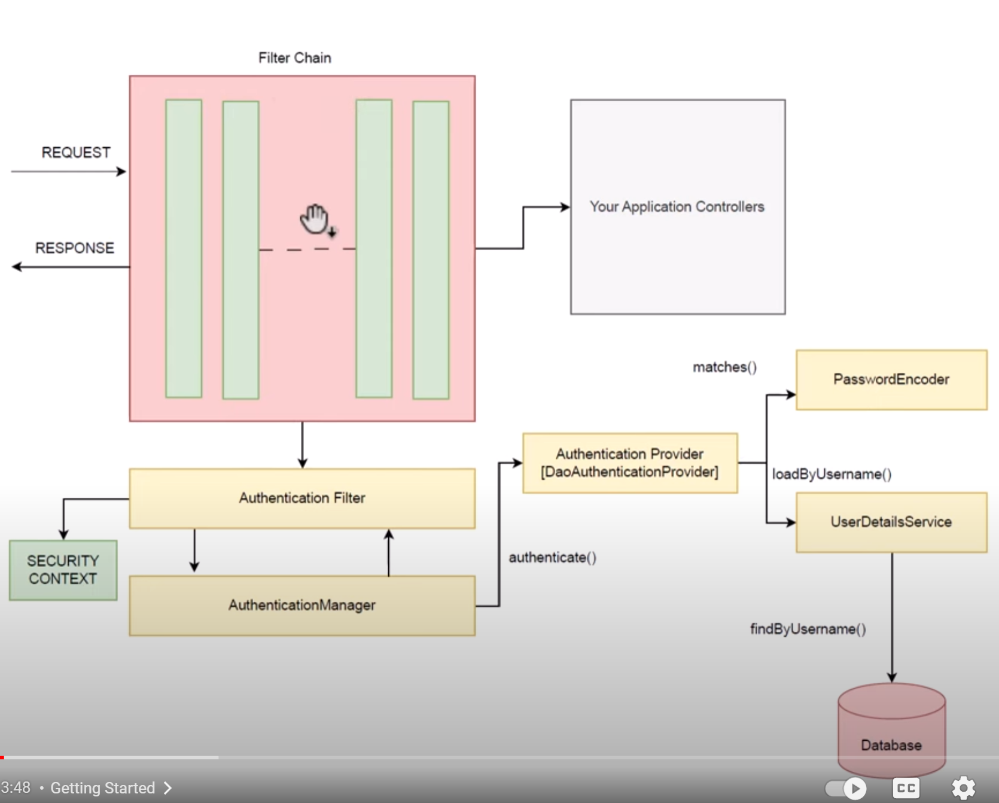

# How Security works in Spring Boot | Spring Security Series | Video #2

- Authentication filter intercept the authentication request and validate the user credentials, by creating authentication object.
- The authentication object wraps the username and password.
- The authentication object is handled by authentication manager. authentication manager decides what to do with these credentials.
- The authentication manager delegates the authentication object to the authentication provider.
- The authentication provider validates the credentials and returns the authentication object.
- Authentication provider needs password encoder to validate the password.
- Authentication provider also need user details service to get the user details and roles. It returns the user details object.
- After authentication provider validates the credentials it will fill out the missing data of authentication object like roles.
- The request is sent back to authentication manager.
- Then it will return to authentication filter.
- Finally, security context is created and the user is authenticated.
- The security context is aware of authenticated user during the session.
- So the details of authenticated user remains in the security context.

## Getting Started with Spring Security and Form Based Authentication | Spring Security | Video #3

- Configuring a spring project with spring security.
- How autoconfiguration magic works in spring boot.
- Check the form based authentication mechanism.

### Steps

- create controller, it is working.
- add authentication dependency to pom.
- try to access the controller again it will ask for username and password.
- /login is the default login page.
- /logout is the default logout page. http://localhost:8080/logout
- By default, every thing is secured and requires authentication.
- The default is form based authentication.
- There are default login and logout form.
- Default username and password is created from you.
- You can open the dev tools to see the login and logout request details.
- You can 
- add property to fix the username and password, this style is good for dev environment only.

## Basic Authentication and writing our own Security Filter | Spring Security Series | Video 4

- Form based authentication is not good for apis.
- There is basic authentication can be used in this case.
- SpringBootWebSecurityConfiguration is the class that is responsible for the default security configuration.
- We can create our custome security filter chain.
- There is a session that is managed based on cookies.
- You can stop this session management by configuring the session policy.

## In Memory Authentication Line By Line | Spring Security Series | Video #5

- In memory authentication is not good for production.
- We need to add bean of UserDetailsService that returns InMemoryUserDetailsManager.

## Role Based Authorization Line By Line | Spring Security Full Course Series | Video #6

- we need @EnableMethodSecurity to enable method level security.
- @PreAuthorize("hasRole('ROLE_ADMIN')") is used to secure the method.
- 401 is fail authentication 403 is fail authorization.

## Enabling H2 Database Line By Line | Spring Security Full Course Series | Video #7

- we need to add h2, jpa dependencies to pom
- we need to add h2 and datasource to property file

## Database Authentication In Spring Boot Line By Line | Spring Security Full Course Tutorial | #8

- spring-security is opensource in github, you can search for users.ddl
- for jdbc we need to create users schema and table.
- During saving role to databse the name is appended with ROLE_XXXX, and we do the check with name only without ROLE_.
- Hashing is done by password encoder.
- bcrypt involves using salting it is a secure algorithm for hashing and one of the most popular ones.
- Salting increase the security.

## Udemy Course

### Section 3 Basic Authentication

- It is simplest form of authentication
- Send username and password in the request header as authorization header.
- Credentials are encoded in base64.
- Format is Basic username:password in base64.
- File SpringBootWebSecurityConfiguration is responsible for the default security configuration.
  - The method defaultSecurityFilterChain is responsible for the default security configuration
    it returns SecurityFilterChain object.
  - It simply mark all requestes as authenticated and enable both form and basic authentication.
  - If we specify our class SecurityFilterChain this default class will be ignored.
- Creating our security config file we need annotation @EnableWebSecurity and @Configuration.
- Then we create @Bean of type SecurityFilterChain that takes HttpSecurity object, this object build is the return of method.

- Basic authentication vs form authentication
- with only basic authentication configured /login will give error.
- we need to enable form login with defaults
- we can sesssion from statfull to stateless.
- We can premit certain requestes and deny others.

### Section 4 Secure Notes Project

- We created Note entity and added lombok and JPA dependencies.
- Adding repos and services.